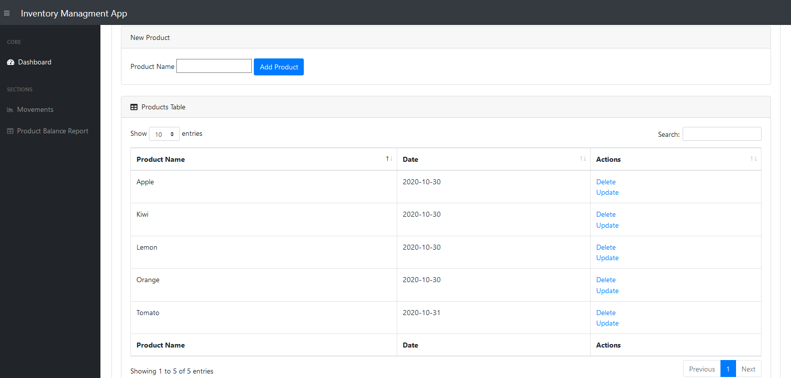
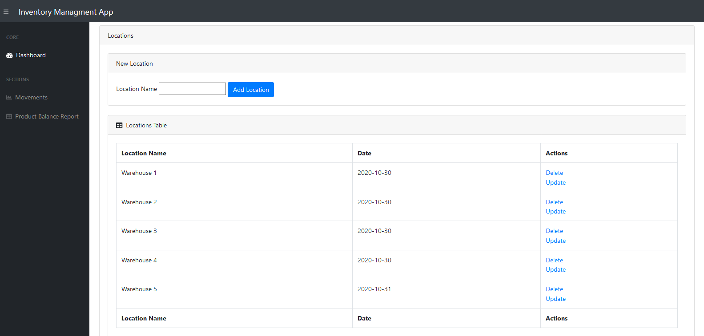
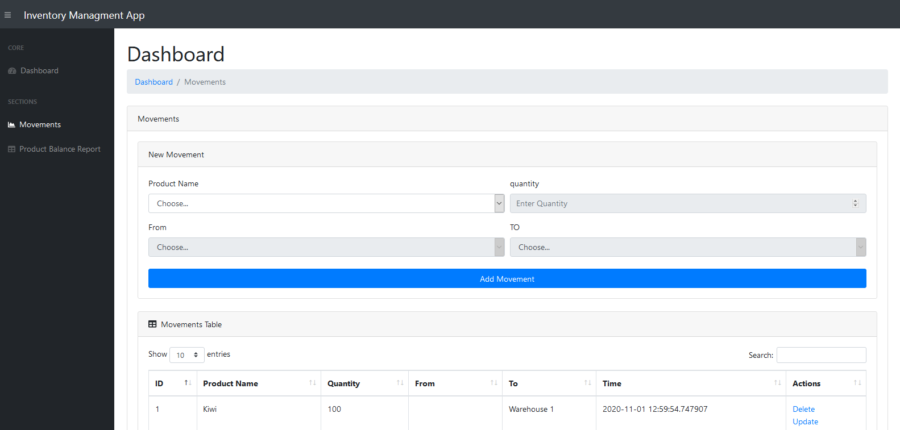
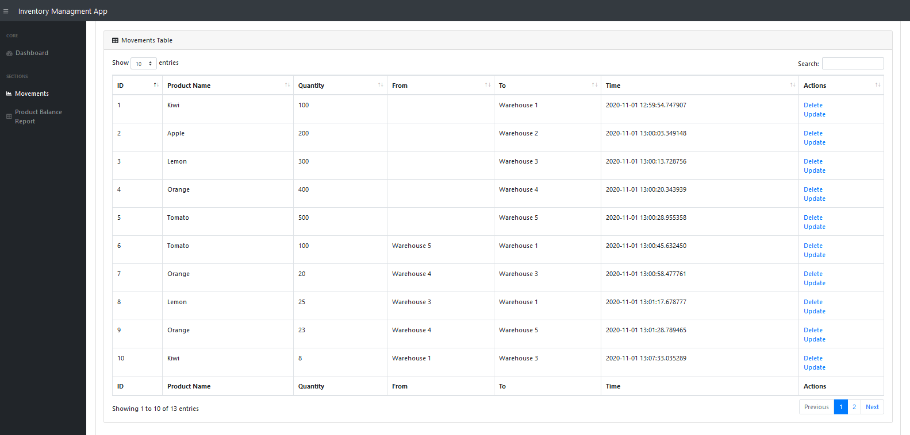

# Flask Inventory Managment project

## Inventory Management Web Application

### The goal is to create a web application using Flask framework to manage inventory of a list of products in respective warehouses. Imagine this application will be used in a shop or a warehouse that needs to keep track of various products and various locations.

## Python, Flask, SQLAlchemy 

## Installation

First, you need to clone this repo:

```bash
$ git clone https://github.com/shraite7/flask-inventory-app.git
```

Then change into the `flask-inventory-app` folder:

```bash
$ cd flask-inventory-app
```

Now, we will need to create a virtual environment and install all the dependencies. We have two options available for now.

Use Pipenv:

```bash
$ pipenv install
$ pipenv shell
```

Or use pip + virtualenv:

```bash
$ virtualenv venv
$ . venv/bin/activate  # on Windows, use "venv\Scripts\activate" instead
$ pip install -r requirements.txt
```
## How to Run the Application?

**Before run the application, make sure you have activated the virtual enviroment:**

```bash
$ flask run
```

## Screenshots

#### This shows the first part of the dashboard which contains the Products and Locations sections




#### This shows the second part of the dashboard while you can add and display locations




#### This shows the Movements section which add movements and display all recorded movements 

### It also show the navigation of the current page



#### a Preview of the Movements records




### The last one shows the Product Balance Report page, which dispaly the total quantity of each product in each Location (warehouse)

")